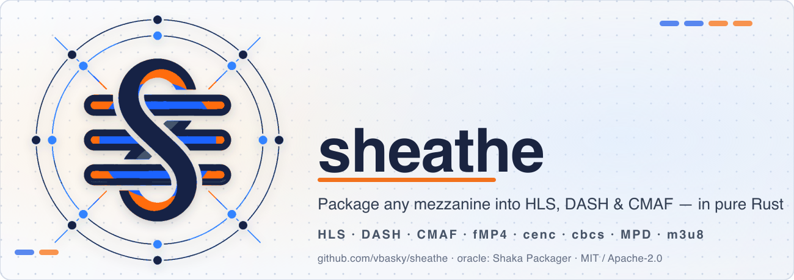

<p align="center">
  
</p>

# sheathe

**Pure-Rust HLS / DASH / CMAF media packager.** A memory-safe, dependency-light
alternative to [Shaka Packager](https://github.com/shaka-project/shaka-packager),
built and validated against it as the reference oracle.

> Status: **working VOD pipeline.** `probe` and `package` demux real MP4 and
> write playable CMAF segments + DASH/HLS manifests with correct codec strings.
> The path to Shaka Packager parity (encryption, more inputs, live) is tracked
> in [`ROADMAP.md`](./ROADMAP.md).

## Why

Mature DASH/HLS manifest *parsers* exist in Rust, but a mature *packager /
origin* does not. `sheathe` fills the Delivery lane: probe → ladder → CMAF
segment → DASH/HLS manifests, with no C/C++ dependencies.

## Workspace layout

| Crate | Role | Shaka Packager analogue |
| ------- | ------ | ------------------------- |
| [`sheathe-core`](crates/sheathe-core)     | Media model: streams, samples, timing, errors | `media/base` |
| [`sheathe-mp4`](crates/sheathe-mp4)       | ISO-BMFF / fMP4 / CMAF box writing + fragmentation | `media/formats/mp4` + chunking |
| [`sheathe-dash`](crates/sheathe-dash)     | MPEG-DASH `.mpd` generation | `mpd` |
| [`sheathe-hls`](crates/sheathe-hls)       | HLS master + media playlist generation | `hls` |
| [`sheathe-crypto`](crates/sheathe-crypto) | Common Encryption (cenc / cbcs) | `media/crypto` |
| [`sheathe`](crates/sheathe) / [`sheathe-cli`](crates/sheathe-cli) | The `sheathe` binary / its CLI library | `app` (`packager`) |

## Install / build

```sh
cargo install sheathe        # installs the `sheathe` binary
# or, from a checkout:
cargo run -p sheathe -- --help
```

## Usage (target CLI)

```sh
# Package an MP4 into 6s CMAF segments with both DASH and HLS manifests.
sheathe package input.mp4 --out site/ --segment-duration 6 --dash --hls

# Inspect what sheathe detects in a file.
sheathe probe input.mp4
```

## Method

Per the workspace's `revelo method`: implement in pure Rust, then
differential-test output (segments, MPD, playlists) against Shaka Packager on a
sample corpus. Numbers and bitstreams that can't be validated against the oracle
don't ship.

## MSRV

Rust **1.85** (declared in `Cargo.toml`'s `workspace.package.rust-version`). CI
reads that exact value and builds against it, so the MSRV can't drift.

## License

`MIT OR Apache-2.0`.
